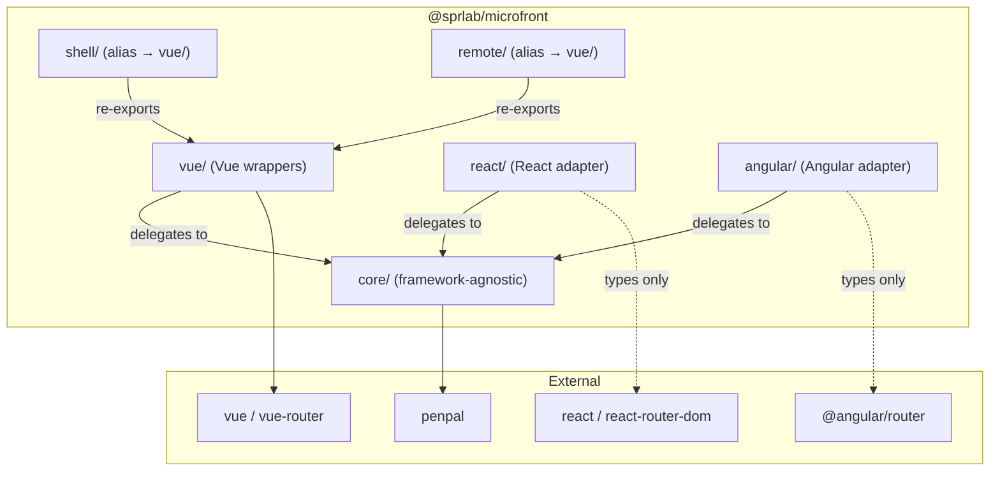

# Design Document: Library Architecture

## Overview

`@sprlab/microfront` is a layered micro frontend library: a framework-agnostic Core Module, Vue wrappers, React adapter, and Angular adapter. The shell (host) is Vue 3; remotes can be Vue 3, Vue 2/Nuxt 2, React, or Angular.

## Architecture



### Layer Responsibilities

| Layer | Responsibility | Framework deps |
|-------|---------------|----------------|
| `core/` | Penpal connection, ResizeObserver height tracking, history patching, iframe detection, messaging, RouterAdapter interface | None (only `penpal`) |
| `vue/` | RemoteApp component, useRemote composable, sprRemote plugin, sprRemoteLegacy, Vue RouterAdapter | `vue`, `vue-router` (optional) |
| `react/` | initReactRemote, createReactRouterAdapter | None (types only from react-router-dom) |
| `angular/` | initAngularRemote, createAngularRouterAdapter | None (types only from @angular/router) |
| `shell/` | Backward-compat alias → vue/ shell exports | None |
| `remote/` | Backward-compat alias → vue/ remote exports | None |

### Build Output

Vite produces six ES module bundles:

| Bundle | Entry | Externals |
|--------|-------|-----------|
| `dist/core.js` | `src/core/index.ts` | `penpal` |
| `dist/vue.js` | `src/vue/index.ts` | `vue`, `vue-router`, `./core.js` |
| `dist/shell.js` | `src/shell/index.ts` | `./vue.js` |
| `dist/remote.js` | `src/remote/index.ts` | `./vue.js` |
| `dist/react-remote.js` | `src/react/remote.ts` | `./core.js` |
| `dist/angular-remote.js` | `src/angular/remote.ts` | `./core.js` |

### Package.json Exports

```json
{
  "exports": {
    "./core":         { "types": "...", "default": "./dist/core.js" },
    "./vue":          { "types": "...", "default": "./dist/vue.js" },
    "./vue/shell":    { "types": "...", "default": "./dist/shell.js" },
    "./vue/remote":   { "types": "...", "default": "./dist/remote.js" },
    "./shell":        { "types": "...", "default": "./dist/shell.js" },
    "./remote":       { "types": "...", "default": "./dist/remote.js" },
    "./react/remote": { "types": "...", "default": "./dist/react-remote.js" },
    "./angular/remote": { "types": "...", "default": "./dist/angular-remote.js" }
  }
}
```

## Source Structure

```
lib/
├── src/
│   ├── core/
│   │   ├── index.ts          # All core exports
│   │   ├── connection.ts      # connectToRemote, initRemote
│   │   ├── height.ts          # observeContentHeight (ResizeObserver)
│   │   ├── history.ts         # patchHistoryPushState
│   │   ├── iframe.ts          # isInsideIframe
│   │   ├── messenger.ts       # createMessenger
│   │   └── types.ts           # All shared types/interfaces/enums
│   ├── vue/
│   │   ├── index.ts           # All vue exports
│   │   ├── RemoteApp.vue      # Shell component (fullHeight support)
│   │   ├── useRemote.ts       # Shell composable
│   │   ├── sprRemote.ts       # Vue 3 plugin
│   │   ├── sprRemoteLegacy.ts # Vue 2 / Nuxt 2 init
│   │   ├── messaging.ts       # send / onMessage
│   │   └── routerAdapter.ts   # createVueRouterAdapter
│   ├── react/
│   │   ├── remote.ts          # initReactRemote, exports
│   │   └── routerAdapter.ts   # createReactRouterAdapter
│   ├── angular/
│   │   ├── remote.ts          # initAngularRemote, exports
│   │   └── routerAdapter.ts   # createAngularRouterAdapter
│   ├── shell/
│   │   └── index.ts           # Alias → vue/ shell exports
│   └── remote/
│       └── index.ts           # Alias → vue/ remote exports
├── dist/                       # Built output (published to npm)
├── package.json                # @sprlab/microfront
├── vite.config.ts
├── vitest.config.ts
└── tsconfig.json
```

## Example Apps Structure

```
examples/
├── vue/
│   ├── shell/                      (port 4000) — Vue 3 host with dropdown nav
│   ├── remote-vue-connection/      (port 4001) — Vue 3 messaging
│   ├── remote-vue-route/           (port 4002) — Vue 3 route sync
│   ├── remote-vue-fullHeight/      (port 4004) — Vue 3 fullHeight (small/scroll/tall)
│   ├── remote-vue2-connection/     (port 4005) — Nuxt 2 messaging
│   ├── remote-vue2-route/          (port 4006) — Nuxt 2 route sync
│   ├── remote-vue2-fullHeight/     (port 4007) — Nuxt 2 fullHeight
│   └── remote3/                    (port 4003) — Legacy Nuxt 2
└── react/
    ├── remote-react-connection/    (port 4010) — React messaging
    ├── remote-react-route/         (port 4011) — React route sync
    └── remote-react-fullHeight/    (port 4012) — React fullHeight
└── angular/
    ├── remote-angular-connection/  (port 4020) — Angular messaging
    ├── remote-angular-route/       (port 4021) — Angular route sync
    └── remote-angular-fullHeight/  (port 4022) — Angular fullHeight
```

## Key Flows

### FullHeight Measurement Flow

```
1. Shell mounts iframe with min-height: 100%
2. On route change in remote:
   a. Shell resets iframe height to baseContainerHeight via DOM
   b. Shell waits 2 requestAnimationFrames
   c. Shell calls remote.onShellContainerHeight(containerHeight) via penpal
   d. Remote waits 2 requestAnimationFrames, measures scrollHeight
   e. Remote returns max(scrollHeight, containerHeight)
   f. Shell sets iframe height if response > containerHeight, else removes explicit height
```

### React Router Adapter

```typescript
// createReactRouterAdapter wraps a createBrowserRouter instance:
{
  getCurrentPath: () => router.state.location.pathname,
  replace: (path) => router.navigate(path, { replace: true }),
  afterEach: (cb) => router.subscribe((state) => cb(state.location.pathname)),
}
```

### Angular Router Adapter

```typescript
// createAngularRouterAdapter wraps an Angular Router instance:
{
  getCurrentPath: () => router.url,
  replace: (path) => router.navigateByUrl(path, { replaceUrl: true }),
  afterEach: (cb) => router.events.subscribe((event) => {
    if (event is NavigationEnd) cb(event.urlAfterRedirects || event.url)
  }),
}
```

### Dependency Strategy for Examples

| Framework | Dependency type | Why |
|-----------|----------------|-----|
| Vue 3 | `link:../../../lib` | Symlink, instant updates during dev |
| Nuxt 2 | `file:../../../lib` | Copies `dist/` only (via `"files"` field), avoids PnP issues |
| React | `link:../../../lib` | Symlink, same as Vue 3 |
| Angular | `link:../../../lib` | Symlink, same as Vue 3 |

Switch between local and npm: `yarn use:local` / `yarn use:npm` + `yarn install:all`.

## Correctness Properties

### Property 1: History patch prevents history growth
After `patchHistoryPushState()`, `pushState` calls SHALL NOT increase `history.length`.

### Property 2: Message broadcast to all handlers
`send(payload)` SHALL invoke every registered handler exactly once.

### Property 3: Backward-compatible re-exports equivalence
Every symbol from `@sprlab/microfront/shell` SHALL be identical to the same symbol from `@sprlab/microfront/vue/shell`. Same for `/remote` and `/vue/remote`.

### Property 4: RouterAdapter route synchronization
`onShellNavigate(path)` SHALL call `routerAdapter.replace(path)` with the exact same path.

### Property 5: React RouterAdapter delegation
`createReactRouterAdapter(router).getCurrentPath()` SHALL return `router.state.location.pathname`. `replace(path)` SHALL call `router.navigate(path, { replace: true })`.

### Property 6: Angular RouterAdapter delegation
`createAngularRouterAdapter(router).getCurrentPath()` SHALL return `router.url`. `replace(path)` SHALL call `router.navigateByUrl(path, { replaceUrl: true })`.
