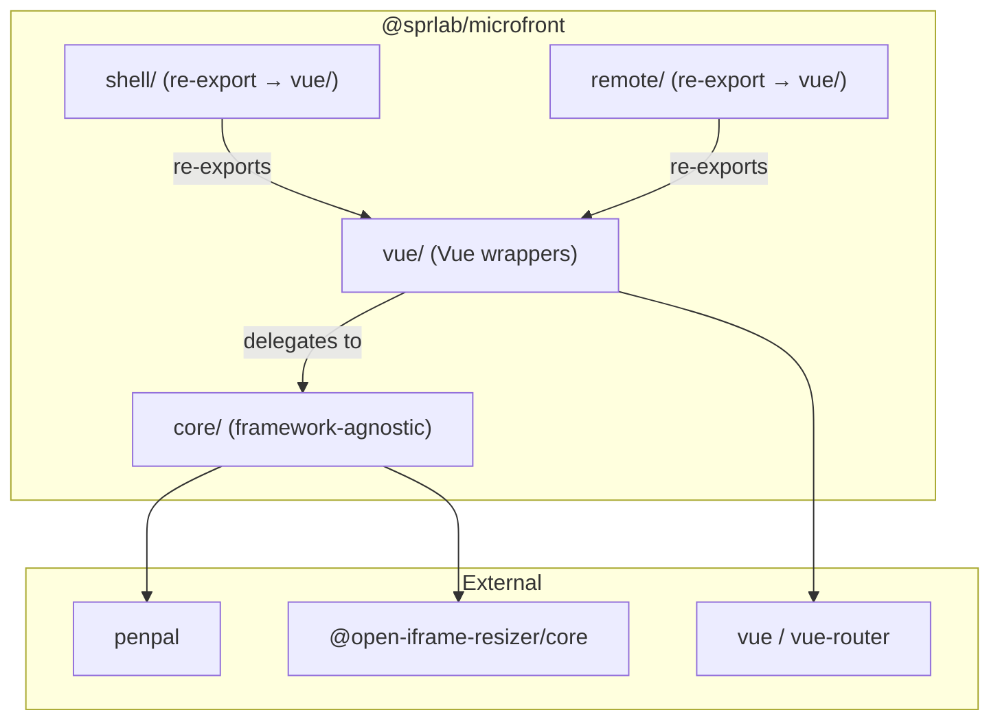
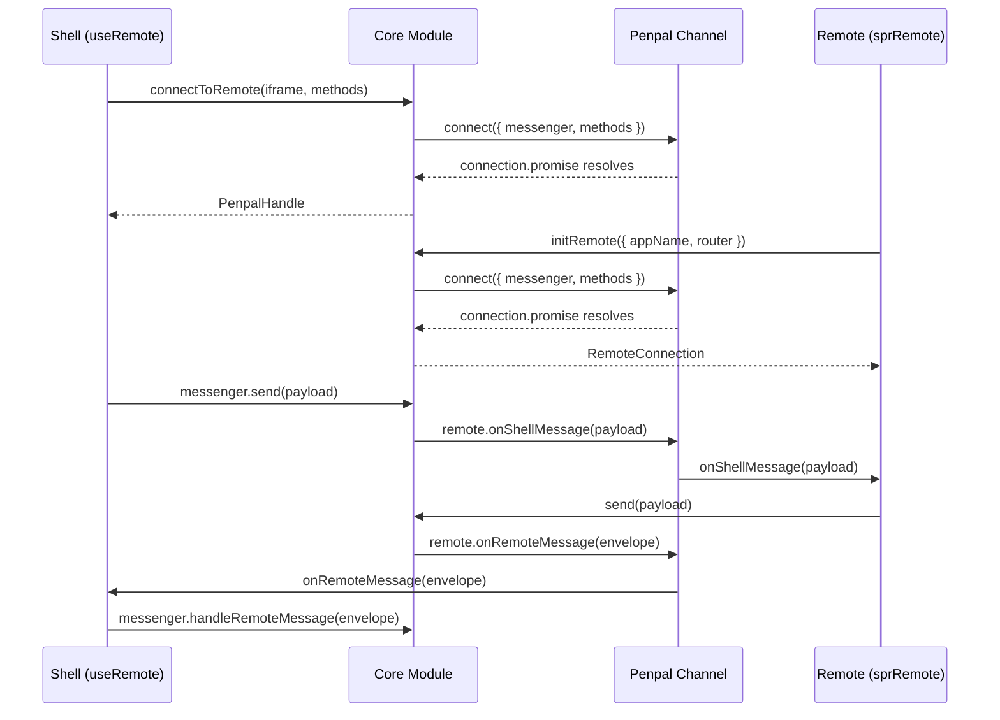
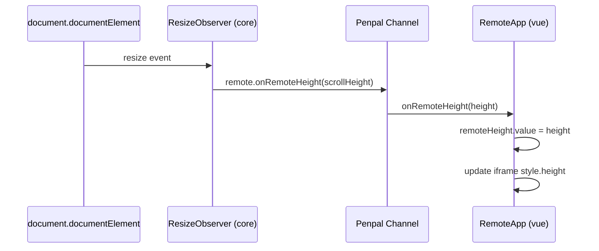
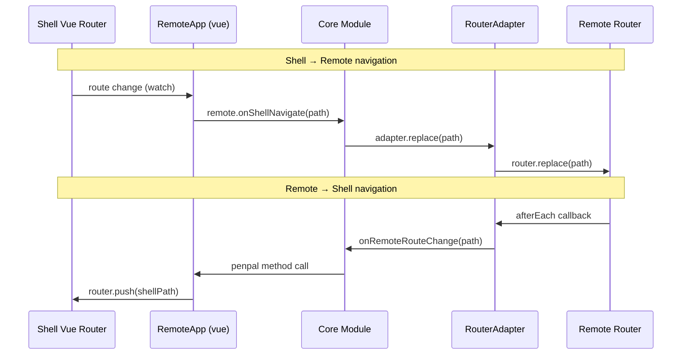

# Design Document: Library Restructure

## Overview

This design describes how to restructure `@sprlab/microfront` from a Vue-coupled library into a layered architecture: a framework-agnostic **Core Module** (`@sprlab/microfront/core`) and a **Vue Module** (`@sprlab/microfront/vue`). The existing Vue-specific entry points (`/shell`, `/remote`) become thin re-exports from the Vue Module for backward compatibility.

The restructure also moves example applications from the repository root into `examples/vue/`, keeping the root clean for future framework examples.

### Goals

- Enable non-Vue consumers to use penpal connection, messaging, resizing, and route sync logic
- Preserve 100% backward compatibility for existing `@sprlab/microfront/shell` and `@sprlab/microfront/remote` imports
- Keep the same npm package name, version scheme, and publish workflow
- Maintain all existing tests (unit + e2e) passing

### Non-Goals

- Adding React/Angular wrappers (future work)
- Changing the penpal or iframe-resizer dependencies
- Modifying the public API surface of the Vue wrappers

## Architecture



### Layer Responsibilities

| Layer | Responsibility | Framework deps |
|-------|---------------|----------------|
| `core/` | Penpal connection, ResizeObserver height tracking, history patching, iframe detection, messaging state machine, RouterAdapter interface | None |
| `vue/` | RemoteApp component, useRemote composable, sprRemote plugin, sprRemoteLegacy init, Vue RouterAdapter factory | `vue`, `vue-router` (optional) |
| `shell/` | Backward-compat re-export of vue/ shell exports | None (re-export only) |
| `remote/` | Backward-compat re-export of vue/ remote exports | None (re-export only) |

### Build Output

Vite produces four ES module bundles:

| Bundle | Entry | Externals |
|--------|-------|-----------|
| `dist/core.js` | `src/core/index.ts` | `penpal`, `@open-iframe-resizer/core` |
| `dist/vue.js` | `src/vue/index.ts` | `vue`, `vue-router`, `./core.js` |
| `dist/shell.js` | `src/shell/index.ts` | `./vue.js` |
| `dist/remote.js` | `src/remote/index.ts` | `./vue.js` |

`vue-tsc` generates `.d.ts` files mirroring the `src/` structure into `dist/`.

## Components and Interfaces

### Core Module (`src/core/index.ts`)

#### Functions

```typescript
/**
 * Returns true if the current window is inside an iframe.
 */
export function isInsideIframe(): boolean

/**
 * Patches window.history.pushState to call replaceState instead,
 * preventing duplicate history entries inside iframes.
 */
export function patchHistoryPushState(): void

/**
 * Observes document.documentElement height via ResizeObserver
 * and calls `onHeight` whenever scrollHeight changes.
 * Returns a cleanup function that disconnects the observer.
 */
export function observeContentHeight(onHeight: (height: number) => void): () => void

/**
 * Establishes a shell-side penpal connection to an iframe.
 * Returns { promise, destroy } — same shape as penpal's connect().
 */
export function connectToRemote(options: ShellConnectionOptions): PenpalHandle

/**
 * Initializes the remote side: penpal connection, height observer,
 * history patch, and optional route sync via RouterAdapter.
 * Returns a RemoteConnection with send/onMessage and the connection promise.
 */
export function initRemote(options: RemoteInitOptions): RemoteConnection

/**
 * Creates a standalone messaging controller (used by Vue's useRemote).
 */
export function createMessenger(): Messenger
```

#### Types & Interfaces

```typescript
/** Status of a remote connection */
export enum ConnectionStatus {
  Loading = 'loading',
  Connected = 'connected',
  Error = 'error',
  NoPlugin = 'no-plugin',
}

/** Envelope for messages from remote → shell */
export interface MessageEnvelope {
  payload: unknown
  metadata: { appName: string }
}

export type MessageHandler = (payload: unknown, metadata: { appName: string }) => void
export type RouteChangeHandler = (path: string) => void

/** Framework-neutral router adapter for route synchronization */
export interface RouterAdapter {
  /** Returns the current route path */
  getCurrentPath(): string
  /** Replaces the current route (no new history entry) */
  replace(path: string): void
  /** Registers a callback invoked after each navigation */
  afterEach(callback: (path: string) => void): void
}

/** Options for shell-side penpal connection */
export interface ShellConnectionOptions {
  iframe: HTMLIFrameElement
  allowedOrigins: string[]
  timeout: number
  methods: Record<string, (...args: unknown[]) => unknown>
}

/** Options for remote-side initialization */
export interface RemoteInitOptions {
  appName?: string
  allowedOrigins?: string[]
  router?: RouterAdapter
  methods?: Record<string, (...args: unknown[]) => unknown>
}

/** Handle returned by connectToRemote */
export interface PenpalHandle {
  promise: Promise<unknown>
  destroy: () => void
}

/** State object returned by initRemote */
export interface RemoteConnection {
  connectionPromise: Promise<unknown>
  send: (payload: unknown) => Promise<void>
  onMessage: (handler: (payload: unknown) => void) => void
}

/** Internal messenger used by shell-side wrappers */
export interface Messenger {
  status: ConnectionStatus
  iframeLoaded: boolean
  setConnection(promise: Promise<unknown>): void
  setIframeLoaded(): void
  send(payload: unknown): Promise<void>
  handleRemoteMessage(envelope: MessageEnvelope): void
  handleRouteChange(path: string): void
  onMessage(handler: MessageHandler): void
  onRouteChange(handler: RouteChangeHandler): void
}
```

### Vue Module (`src/vue/index.ts`)

#### Shell-side exports

```typescript
/** Vue component wrapping an iframe managed by core */
export { default as RemoteApp } from './RemoteApp.vue'

/** Composable: creates/reuses messenger via provide/inject, returns reactive status */
export { useRemote, RemoteStatus } from './useRemote'
export type { RemoteMessenger, RemoteMessageEnvelope } from './useRemote'
```

#### Remote-side exports

```typescript
/** Vue 3 plugin — delegates to core.initRemote with a Vue RouterAdapter */
export { sprRemote } from './sprRemote'

/** Vue 2 / Nuxt 2 initializer — same delegation */
export { sprRemoteLegacy } from './sprRemoteLegacy'

/** Messaging API (thin wrappers around core) */
export { send, onMessage } from './messaging'
```

#### Vue RouterAdapter factory

```typescript
/**
 * Creates a RouterAdapter from a Vue Router instance.
 * Compatible with Vue Router v3 (Nuxt 2), v4, and v5.
 */
export function createVueRouterAdapter(router: any): RouterAdapter
```

### Backward-Compat Re-exports

`src/shell/index.ts`:
```typescript
export { RemoteApp, useRemote, RemoteStatus } from '../vue/index'
export type { RemoteMessenger, RemoteMessageEnvelope } from '../vue/index'
```

`src/remote/index.ts`:
```typescript
export { sprRemote, sprRemoteLegacy, send, onMessage } from '../vue/index'
export type { SprRemoteOptions } from '../vue/index'
```

## Data Models

### Message Flow



### Height Observation Flow



### Route Synchronization Flow



### Source Directory Structure (after restructure)

```
libs/spr-microfront/src/
├── core/
│   ├── index.ts              # All core exports
│   ├── connection.ts          # connectToRemote, initRemote
│   ├── height.ts              # observeContentHeight
│   ├── history.ts             # patchHistoryPushState
│   ├── iframe.ts              # isInsideIframe
│   ├── messenger.ts           # createMessenger
│   ├── types.ts               # All shared types/interfaces/enums
│   └── __tests__/
│       └── core.test.ts
├── vue/
│   ├── index.ts               # All vue exports (shell + remote)
│   ├── RemoteApp.vue          # Shell component
│   ├── useRemote.ts           # Shell composable
│   ├── sprRemote.ts           # Vue 3 plugin
│   ├── sprRemoteLegacy.ts     # Vue 2 / Nuxt 2 init
│   ├── messaging.ts           # send / onMessage wrappers
│   ├── routerAdapter.ts       # createVueRouterAdapter
│   └── __tests__/
│       ├── useRemote.test.ts
│       └── remote.test.ts
├── shell/
│   └── index.ts               # Re-export from vue/
└── remote/
    └── index.ts               # Re-export from vue/
```

### Example Apps Structure (after restructure)

```
examples/
└── vue/
    ├── shell/          (port 4000)
    ├── remote1/        (port 4001)
    ├── remote2/        (port 4002)
    └── remote3/        (Nuxt 2, port 3000)
```

### Package.json Exports Map

```json
{
  "exports": {
    "./core": {
      "import": "./dist/core.js",
      "types": "./dist/core/index.d.ts"
    },
    "./vue": {
      "import": "./dist/vue.js",
      "types": "./dist/vue/index.d.ts"
    },
    "./shell": {
      "import": "./dist/shell.js",
      "types": "./dist/shell/index.d.ts"
    },
    "./remote": {
      "import": "./dist/remote.js",
      "types": "./dist/remote/index.d.ts"
    }
  }
}
```

### Vite Build Config (updated)

```typescript
import { defineConfig } from 'vite'
import vue from '@vitejs/plugin-vue'
import { resolve } from 'path'

export default defineConfig({
  plugins: [vue()],
  build: {
    lib: {
      entry: {
        core: resolve(__dirname, 'src/core/index.ts'),
        vue: resolve(__dirname, 'src/vue/index.ts'),
        shell: resolve(__dirname, 'src/shell/index.ts'),
        remote: resolve(__dirname, 'src/remote/index.ts'),
      },
      formats: ['es'],
    },
    rollupOptions: {
      external: [
        'vue', 'vue-router',
        'penpal', '@open-iframe-resizer/core',
      ],
      output: {
        entryFileNames: '[name].js',
      },
    },
    outDir: 'dist',
    emptyOutDir: true,
  },
})
```

## Correctness Properties

*A property is a characteristic or behavior that should hold true across all valid executions of a system — essentially, a formal statement about what the system should do. Properties serve as the bridge between human-readable specifications and machine-verifiable correctness guarantees.*

### Property 1: History patch prevents history growth

*For any* state data object and any URL string, after `patchHistoryPushState()` is called, invoking `window.history.pushState(state, '', url)` SHALL NOT increase `window.history.length`.

**Validates: Requirements 1.3**

### Property 2: Message broadcast to all handlers

*For any* set of registered message handlers (1 or more) and any message payload, calling `send(payload)` SHALL invoke every registered handler exactly once with the same payload.

**Validates: Requirements 1.6**

### Property 3: Backward-compatible re-exports equivalence

*For any* public symbol exported by `@sprlab/microfront/shell`, the same symbol SHALL be importable from `@sprlab/microfront/vue` with identical reference identity. The same SHALL hold for all symbols exported by `@sprlab/microfront/remote`.

**Validates: Requirements 3.3**

### Property 4: RouterAdapter route synchronization

*For any* valid path string, when the shell sends a navigation command via penpal's `onShellNavigate(path)`, the Core_Module SHALL call `routerAdapter.replace(path)` with the exact same path string.

**Validates: Requirements 8.2**

### Property 5: Vue RouterAdapter factory delegation

*For any* path string, a `RouterAdapter` created by `createVueRouterAdapter(router)` SHALL return the Vue Router's current path from `getCurrentPath()`, and calling `replace(path)` SHALL delegate to `router.replace(path)` with the same path argument.

**Validates: Requirements 8.4**

## Error Handling

### Connection Errors

| Scenario | Behavior |
|----------|----------|
| Remote server unreachable | `connectToRemote` promise rejects → status becomes `Error` |
| Remote server responds but no plugin installed | iframe loads but penpal times out → status becomes `NoPlugin` |
| Penpal connection timeout | Promise.race rejects after `timeout` ms → status becomes `Error` or `NoPlugin` based on iframe load state |

### Messaging Errors

| Scenario | Behavior |
|----------|----------|
| `send()` called before connection established | Logs `console.warn` with descriptive message, returns without throwing |
| `onMessage()` called before plugin install | Handler is silently ignored (no-op) — matches current behavior |

### Route Sync Errors

| Scenario | Behavior |
|----------|----------|
| No RouterAdapter provided | Route sync logic is skipped entirely, no errors |
| RouterAdapter.replace throws | Error is caught and logged, does not break penpal connection |
| Shell navigates while penpal not yet connected | Navigation queued until connection resolves |

### Build Errors

| Scenario | Behavior |
|----------|----------|
| `yarn build` fails | Vite exits with non-zero status and descriptive error |
| TypeScript declaration generation fails | `vue-tsc` exits with non-zero status |

## Testing Strategy

### Unit Tests (vitest)

Unit tests verify specific behaviors and edge cases:

- **Core module**: `isInsideIframe`, `patchHistoryPushState`, `observeContentHeight` callback, `createMessenger` API shape
- **Vue module**: `useRemote` composable API and provide/inject sharing, `sprRemote` plugin installation, `sprRemoteLegacy.init`, `createVueRouterAdapter` delegation
- **Re-exports**: `shell/index.ts` and `remote/index.ts` export the same symbols as `vue/index.ts`

### Property-Based Tests (vitest + fast-check)

Property-based tests verify universal correctness properties across randomized inputs. Each property test runs a minimum of 100 iterations.

- **Library**: [fast-check](https://github.com/dubzzz/fast-check) — the standard PBT library for TypeScript/JavaScript
- **Runner**: vitest (already in use)
- **Minimum iterations**: 100 per property

Each property test is tagged with a comment referencing the design property:

```typescript
// Feature: library-restructure, Property 1: History patch prevents history growth
// Feature: library-restructure, Property 2: Message broadcast to all handlers
// Feature: library-restructure, Property 3: Backward-compatible re-exports equivalence
// Feature: library-restructure, Property 4: RouterAdapter route synchronization
// Feature: library-restructure, Property 5: Vue RouterAdapter factory delegation
```

### E2E Tests (Playwright)

The existing e2e test suite validates end-to-end behavior with all example apps running:

- Iframe loading and visibility for all remotes
- Automatic iframe height resizing
- Bidirectional messaging (shell ↔ remote)
- Route synchronization (initial redirect, navigation clicks)
- History patching (pushState → replaceState in iframes)
- Back/forward browser navigation
- Nuxt 2 legacy compatibility (remote3)

### Test Execution

| Command | Scope |
|---------|-------|
| `yarn test` (in `libs/spr-microfront/`) | Unit + property tests |
| `npx tsx e2e/e2e.test.ts` (in root) | E2E tests (requires all dev servers running) |
